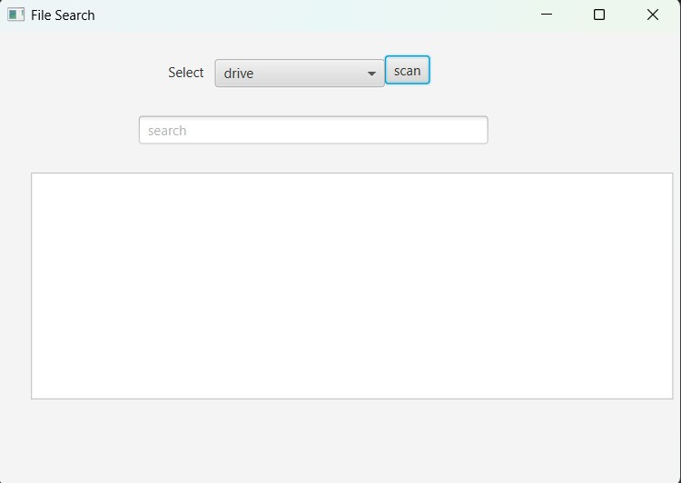

# File Search for Windows

A fast and efficient file search utility for Windows built with JavaFX.

## Features



- Quick file searching with fuzzy matching
- Global hotkey support (Ctrl+Space) for quick access
- Clean and responsive JavaFX UI
- Efficient file indexing and searching algorithms
- SQLite database backend for fast indexed searches
- Batch processing for efficient file system indexing
- Direct file opening from search results

## Planned Features

- Real-time autocomplete suggestions while typing

## Requirements

- Java 17 or higher
- Windows 10/11

## Installation

1. Download the latest release
2. Run the executable JAR file:
   ```bash
   java -jar filesearch.jar
   ```

## Usage

1. Launch the application
2. Use the search bar to find files
3. Press Ctrl+Space from anywhere to quickly open the search window

## Building from Source

```bash
mvn clean package
```

## Code Structure

### Core Application
- `HelloApplication.java` - Main JavaFX application entry point. Manages:
  - Primary stage setup
  - Scene initialization
  - Application lifecycle (start/stop)
  - Coordinates with HotKeyManager for global shortcuts

### Controllers
- `HelloController.java` - Basic example controller demonstrating JavaFX UI interactions
- `ScannerController.java` - Main search interface controller with:
  - Drive selection (ComboBox)
  - Scanning functionality
  - Database interaction via DBOperations

### Database Layer
- `DBOperations.java` - Core database operations:
  - File indexing (writePathToDB)
  - Batch processing of file paths
  - Search functionality (searchPaths)
- `DatabaseConnection.java` - Singleton SQLite connection manager

### File System Utilities
- `FileUtils.java` - File system operations:
  - Directory traversal
  - File listing
  - Access control handling

### Search Functionality
- `FuzzyMatcher.java` - (Future) Fuzzy matching algorithms
- `SearchService.java` - (Future) Core search service implementation

### System Integration
- `HotKeyManager.java` - Global hotkey management:
  - Registers Alt+Shift+Z hotkey
  - Handles Windows message loop
  - Triggers application visibility
- `User32.java` - JNA interface for Windows User32 API:
  - Hotkey registration
  - Message handling

## Architecture Flow
1. User triggers hotkey (Alt+Shift+Z)
2. HotKeyManager shows application via HelloApplication
3. User selects drive in ScannerController
4. ScannerController uses DBOperations to index files
5. Search queries use DBOperations to query SQLite database
6. Results displayed in JavaFX UI

## License

[MIT](LICENSE)

